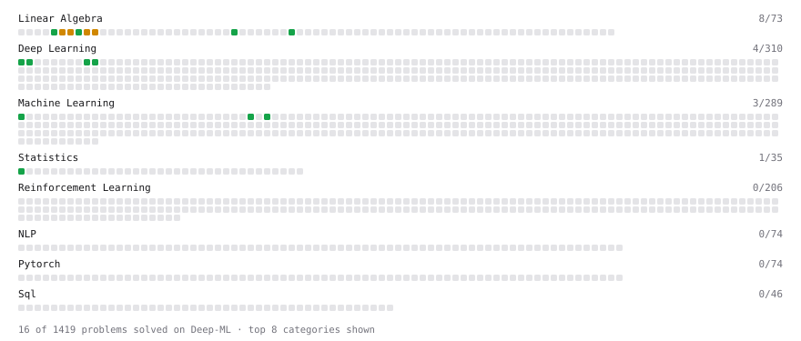

# Deep-ML

My machine learning practice from [Deep-ML](https://www.deep-ml.com). Every solution here was written by hand.

**11** solved · 11 problems · 0 labs · 0 math

[**Browse the interactive portfolio**](https://JanFlajz.github.io/deep-ml/) to replay this filling in over time.

## Problems

| | Difficulty | Solved | |
| --- | --- | --- | --- |
| [Calculate 2x2 Matrix Inverse](https://www.deep-ml.com/problems/8) | easy | 2026-09-18 | [solution](problems/0008-calculate-2x2-matrix-inverse) |
| [Calculate Covariance Matrix](https://www.deep-ml.com/problems/10) | easy | 2026-09-18 | [solution](problems/0010-calculate-covariance-matrix) |
| [Generate a Confusion Matrix for Binary Classification](https://www.deep-ml.com/problems/75) | easy | 2026-09-18 | [solution](problems/0075-generate-a-confusion-matrix-for-binary-classification) |
| [Implement ReLU Activation Function](https://www.deep-ml.com/problems/42) | easy | 2026-09-18 | [solution](problems/0042-implement-relu-activation-function) |
| [Linear Regression Using Normal Equation](https://www.deep-ml.com/problems/14) | easy | 2026-09-18 | [solution](problems/0014-linear-regression-using-normal-equation) |
| [Scalar Multiplication of a Matrix](https://www.deep-ml.com/problems/5) | easy | 2026-09-18 | [solution](problems/0005-scalar-multiplication-of-a-matrix) |
| [Sigmoid Activation Function Understanding](https://www.deep-ml.com/problems/22) | easy | 2026-09-18 | [solution](problems/0022-sigmoid-activation-function-understanding) |
| [Calculate Eigenvalues of a Matrix](https://www.deep-ml.com/problems/6) | medium | 2026-09-18 | [solution](problems/0006-calculate-eigenvalues-of-a-matrix) |
| [Matrix times Matrix ](https://www.deep-ml.com/problems/9) | medium | 2026-09-18 | [solution](problems/0009-matrix-times-matrix) |
| [Matrix Transformation ](https://www.deep-ml.com/problems/7) | medium | 2026-09-18 | [solution](problems/0007-matrix-transformation) |
| [Solve Linear Equations using Jacobi Method](https://www.deep-ml.com/problems/11) | medium | 2026-09-18 | [solution](problems/0011-solve-linear-equations-using-jacobi-method) |

---

_This file is regenerated by Deep-ML on every push._
