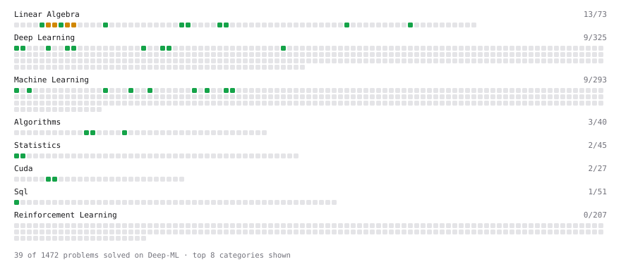

# Deep-ML

My machine learning practice from [Deep-ML](https://www.deep-ml.com). Every solution here was written by hand.

**47** solved · 47 problems · 0 labs · 0 math

[**Browse the interactive portfolio**](https://JanFlajz.github.io/deep-ml/) to replay this filling in over time.

## Problems

| | Difficulty | Solved | |
| --- | --- | --- | --- |
| [Binary Classification with Logistic Regression](https://www.deep-ml.com/problems/104) | easy | 2026-09-28 | [solution](problems/0104-binary-classification-with-logistic-regression) |
| [Calculate 2x2 Matrix Inverse](https://www.deep-ml.com/problems/8) | easy | 2026-09-18 | [solution](problems/0008-calculate-2x2-matrix-inverse) |
| [Calculate Accuracy Score](https://www.deep-ml.com/problems/36) | easy | 2026-09-22 | [solution](problems/0036-calculate-accuracy-score) |
| [Calculate Cosine Similarity Between Vectors](https://www.deep-ml.com/problems/76) | easy | 2026-09-18 | [solution](problems/0076-calculate-cosine-similarity-between-vectors) |
| [Calculate Covariance Matrix](https://www.deep-ml.com/problems/10) | easy | 2026-09-18 | [solution](problems/0010-calculate-covariance-matrix) |
| [Calculate Mean Absolute Error (MAE)](https://www.deep-ml.com/problems/93) | easy | 2026-09-19 | [solution](problems/0093-calculate-mean-absolute-error-mae) |
| [Compute the Cross Product of Two 3D Vectors](https://www.deep-ml.com/problems/118) | easy | 2026-10-02 | [solution](problems/0118-compute-the-cross-product-of-two-3d-vectors) |
| [Convert Vector to Diagonal Matrix](https://www.deep-ml.com/problems/35) | easy | 2026-09-28 | [solution](problems/0035-convert-vector-to-diagonal-matrix) |
| [Count Words Appearing Exactly Once in Each of Two Lists](https://www.deep-ml.com/problems/1141) | easy | 2026-09-19 | [solution](problems/1141-count-words-appearing-exactly-once-in-each-of-two-lists) |
| [Descriptive Statistics Calculator](https://www.deep-ml.com/problems/78) | easy | 2026-09-27 | [solution](problems/0078-descriptive-statistics-calculator) |
| [Detect Overfitting or Underfitting](https://www.deep-ml.com/problems/86) | easy | 2026-09-18 | [solution](problems/0086-detect-overfitting-or-underfitting) |
| [Dot Product Calculator](https://www.deep-ml.com/problems/83) | easy | 2026-09-28 | [solution](problems/0083-dot-product-calculator) |
| [Feature Scaling Implementation](https://www.deep-ml.com/problems/16) | easy | 2026-09-22 | [solution](problems/0016-feature-scaling-implementation) |
| [First N Fibonacci Numbers](https://www.deep-ml.com/problems/1151) | easy | 2026-09-19 | [solution](problems/1151-first-n-fibonacci-numbers) |
| [GeLU Activation Function ](https://www.deep-ml.com/problems/147) | easy | 2026-09-28 | [solution](problems/0147-gelu-activation-function) |
| [Generate a Confusion Matrix for Binary Classification](https://www.deep-ml.com/problems/75) | easy | 2026-09-18 | [solution](problems/0075-generate-a-confusion-matrix-for-binary-classification) |
| [Implement Precision Metric](https://www.deep-ml.com/problems/46) | easy | 2026-09-28 | [solution](problems/0046-implement-precision-metric) |
| [Implement Recall Metric in Binary Classification](https://www.deep-ml.com/problems/52) | easy | 2026-09-28 | [solution](problems/0052-implement-recall-metric-in-binary-classification) |
| [Implement ReLU Activation Function](https://www.deep-ml.com/problems/42) | easy | 2026-09-18 | [solution](problems/0042-implement-relu-activation-function) |
| [Implement the ELU Activation Function](https://www.deep-ml.com/problems/97) | easy | 2026-10-01 | [solution](problems/0097-implement-the-elu-activation-function) |
| [Implement the Hard Sigmoid Activation Function](https://www.deep-ml.com/problems/96) | easy | 2026-09-22 | [solution](problems/0096-implement-the-hard-sigmoid-activation-function) |
| [Implement the SELU Activation Function](https://www.deep-ml.com/problems/103) | easy | 2026-10-01 | [solution](problems/0103-implement-the-selu-activation-function) |
| [Implement the Softplus Activation Function](https://www.deep-ml.com/problems/99) | easy | 2026-09-28 | [solution](problems/0099-implement-the-softplus-activation-function) |
| [Implement the Softsign Activation Function](https://www.deep-ml.com/problems/100) | easy | 2026-09-28 | [solution](problems/0100-implement-the-softsign-activation-function) |
| [Implementation of Log Softmax Function](https://www.deep-ml.com/problems/39) | easy | 2026-09-19 | [solution](problems/0039-implementation-of-log-softmax-function) |
| [Leaky ReLU Activation Function](https://www.deep-ml.com/problems/44) | easy | 2026-09-18 | [solution](problems/0044-leaky-relu-activation-function) |
| [Linear Kernel Function](https://www.deep-ml.com/problems/45) | easy | 2026-10-01 | [solution](problems/0045-linear-kernel-function) |
| [Linear Regression Using Normal Equation](https://www.deep-ml.com/problems/14) | easy | 2026-09-18 | [solution](problems/0014-linear-regression-using-normal-equation) |
| [Matrix Determinant & Trace](https://www.deep-ml.com/problems/195) | easy | 2026-09-18 | [solution](problems/0195-matrix-determinant-trace) |
| [Measure Disorder in Apple Colors](https://www.deep-ml.com/problems/108) | easy | 2026-10-01 | [solution](problems/0108-measure-disorder-in-apple-colors) |
| [Poisson Distribution Probability Calculator](https://www.deep-ml.com/problems/81) | easy | 2026-10-01 | [solution](problems/0081-poisson-distribution-probability-calculator) |
| [Random Shuffle of Dataset](https://www.deep-ml.com/problems/29) | easy | 2026-10-02 | [solution](problems/0029-random-shuffle-of-dataset) |
| [ReLU Activation](https://www.deep-ml.com/problems/1204) | easy | 2026-09-22 | [solution](problems/1204-relu-activation) |
| [Scalar Multiplication of a Matrix](https://www.deep-ml.com/problems/5) | easy | 2026-09-18 | [solution](problems/0005-scalar-multiplication-of-a-matrix) |
| [Scalar Multiply (a * x)](https://www.deep-ml.com/problems/1203) | easy | 2026-09-22 | [solution](problems/1203-scalar-multiply-a-x) |
| [SELECT all rows](https://www.deep-ml.com/problems/1101) | easy | 2026-09-28 | [solution](problems/1101-select-all-rows) |
| [Sigmoid Activation Function Understanding](https://www.deep-ml.com/problems/22) | easy | 2026-09-18 | [solution](problems/0022-sigmoid-activation-function-understanding) |
| [Softmax Activation Function Implementation ](https://www.deep-ml.com/problems/23) | easy | 2026-09-18 | [solution](problems/0023-softmax-activation-function-implementation) |
| [Tensor Puzzle: Ones Vector from First Principles](https://www.deep-ml.com/problems/1268) | easy | 2026-09-28 | [solution](problems/1268-tensor-puzzle-ones-vector-from-first-principles) |
| [Tensor Puzzle: Reverse a Vector](https://www.deep-ml.com/problems/1278) | easy | 2026-09-28 | [solution](problems/1278-tensor-puzzle-reverse-a-vector) |
| [Top-K Largest Elements in a List](https://www.deep-ml.com/problems/1137) | easy | 2026-09-19 | [solution](problems/1137-top-k-largest-elements-in-a-list) |
| [Transformation Matrix from Basis B to C](https://www.deep-ml.com/problems/27) | easy | 2026-10-01 | [solution](problems/0027-transformation-matrix-from-basis-b-to-c) |
| [Vector Element-wise Sum](https://www.deep-ml.com/problems/121) | easy | 2026-09-28 | [solution](problems/0121-vector-element-wise-sum) |
| [Calculate Eigenvalues of a Matrix](https://www.deep-ml.com/problems/6) | medium | 2026-09-18 | [solution](problems/0006-calculate-eigenvalues-of-a-matrix) |
| [Matrix times Matrix ](https://www.deep-ml.com/problems/9) | medium | 2026-09-18 | [solution](problems/0009-matrix-times-matrix) |
| [Matrix Transformation ](https://www.deep-ml.com/problems/7) | medium | 2026-09-18 | [solution](problems/0007-matrix-transformation) |
| [Solve Linear Equations using Jacobi Method](https://www.deep-ml.com/problems/11) | medium | 2026-09-18 | [solution](problems/0011-solve-linear-equations-using-jacobi-method) |

---

_This file is regenerated by Deep-ML on every push._
